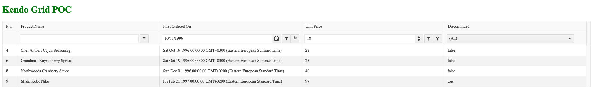
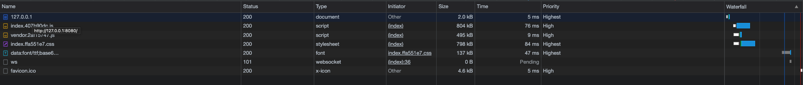
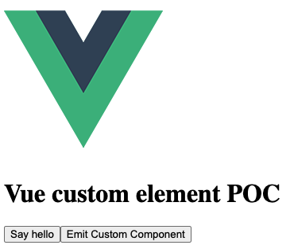

# Vue 3 + Vite + Kendo - Custom Elements





### Setup
- `npm install -g vite`
- `npm init vite@latest`
  - enter project name, for instance 'vue-kendo-grid-poc'
  - pick `vue`
  - pick `vue`
- `cd vue-kendo-grid-poc`
- `npm install`
- remove `App.vue`, `/components` (we don't need it anymore)
- add `src/gird-poc.ce.vue`, with the following content:
```html
<script>
import '@progress/kendo-theme-default/dist/all.css';
import { Grid } from '@progress/kendo-vue-grid';
import { filterBy } from '@progress/kendo-data-query';
import { sampleProducts } from './products';

export default {
  components: {
      'Grid': Grid
  },
  data: function () {
      return {
          filter: {
              logic: "and",
              filters: [
                  { field: "UnitPrice", operator: "neq", value: 18 },
                  { field: "FirstOrderedOn", operator: "gte", value:new Date("1996-10-10") }
              ]
          }
      };
  },
  computed: {
      products: function() {
          return filterBy(sampleProducts, this.filter);
      },
      columns: function () {
          return [
              { field: 'ProductID', filterable:false, title: 'Product ID', width:'50px'},
              { field: 'ProductName', title: 'Product Name' },
              { field: 'FirstOrderedOn', filter:'date', title: 'First Ordered On'},
              { field: 'UnitPrice', filter:'numeric', title: 'Unit Price'},
              { field: 'Discontinued', filter:'boolean', title: 'Discontinued'}
          ]
      }
  },
  methods: {
      filterChange: function(ev) {
          this.filter = ev.filter;
      }
  }
}
</script>

<template>
  <h1>Kendo Grid POC</h1>
  <Grid
        :data-items="products"
        :filterable="true"
        :filter="filter"
        @filterchange="filterChange"
        :columns="columns">
    </Grid>
</template>

<style>
  @import '../node_modules/@progress/kendo-theme-default/dist/all.css';

  h1 {
    color: green;
  }
</style>
```
- update `src/main.js` to:
```javascript
import { defineCustomElement } from "vue";
import GridPoc from "./grid-poc.ce.vue";

const element = defineCustomElement(GridPoc);

customElements.define("grid-poc", element);
```
- add `src/products.js`:
```javascript
const sampleProducts = [
  {
    ProductID: 1,
    ProductName: "Chai",
    SupplierID: 1,
    CategoryID: 1,
    QuantityPerUnit: "10 boxes x 20 bags",
    UnitPrice: 18,
    UnitsInStock: 39,
    UnitsOnOrder: 0,
    ReorderLevel: 10,
    Discontinued: false,
    Category: {
      CategoryID: 1,
      CategoryName: "Beverages",
      Description: "Soft drinks, coffees, teas, beers, and ales",
    },
    FirstOrderedOn: new Date(1996, 8, 20),
  },
  {
    ProductID: 2,
    ProductName: "Chang",
    SupplierID: 1,
    CategoryID: 1,
    QuantityPerUnit: "24 - 12 oz bottles",
    UnitPrice: 19,
    UnitsInStock: 17,
    UnitsOnOrder: 40,
    ReorderLevel: 25,
    Discontinued: false,
    Category: {
      CategoryID: 1,
      CategoryName: "Beverages",
      Description: "Soft drinks, coffees, teas, beers, and ales",
    },
    FirstOrderedOn: new Date(1996, 7, 12),
  },
  {
    ProductID: 3,
    ProductName: "Aniseed Syrup",
    SupplierID: 1,
    CategoryID: 2,
    QuantityPerUnit: "12 - 550 ml bottles",
    UnitPrice: 10,
    UnitsInStock: 13,
    UnitsOnOrder: 70,
    ReorderLevel: 25,
    Discontinued: false,
    Category: {
      CategoryID: 2,
      CategoryName: "Condiments",
      Description: "Sweet and savory sauces, relishes, spreads, and seasonings",
    },
    FirstOrderedOn: new Date(1996, 8, 26),
  },
  {
    ProductID: 4,
    ProductName: "Chef Anton's Cajun Seasoning",
    SupplierID: 2,
    CategoryID: 2,
    QuantityPerUnit: "48 - 6 oz jars",
    UnitPrice: 22,
    UnitsInStock: 53,
    UnitsOnOrder: 0,
    ReorderLevel: 0,
    Discontinued: false,
    Category: {
      CategoryID: 2,
      CategoryName: "Condiments",
      Description: "Sweet and savory sauces, relishes, spreads, and seasonings",
    },
    FirstOrderedOn: new Date(1996, 9, 19),
  },
  {
    ProductID: 5,
    ProductName: "Chef Anton's Gumbo Mix",
    SupplierID: 2,
    CategoryID: 2,
    QuantityPerUnit: "36 boxes",
    UnitPrice: 21.35,
    UnitsInStock: 0,
    UnitsOnOrder: 0,
    ReorderLevel: 0,
    Discontinued: true,
    Category: {
      CategoryID: 2,
      CategoryName: "Condiments",
      Description: "Sweet and savory sauces, relishes, spreads, and seasonings",
    },
    FirstOrderedOn: new Date(1996, 7, 17),
  },
  {
    ProductID: 6,
    ProductName: "Grandma's Boysenberry Spread",
    SupplierID: 3,
    CategoryID: 2,
    QuantityPerUnit: "12 - 8 oz jars",
    UnitPrice: 25,
    UnitsInStock: 120,
    UnitsOnOrder: 0,
    ReorderLevel: 25,
    Discontinued: false,
    Category: {
      CategoryID: 2,
      CategoryName: "Condiments",
      Description: "Sweet and savory sauces, relishes, spreads, and seasonings",
    },
    FirstOrderedOn: new Date(1996, 9, 19),
  },
  {
    ProductID: 7,
    ProductName: "Uncle Bob's Organic Dried Pears",
    SupplierID: 3,
    CategoryID: 7,
    QuantityPerUnit: "12 - 1 lb pkgs.",
    UnitPrice: 30,
    UnitsInStock: 15,
    UnitsOnOrder: 0,
    ReorderLevel: 10,
    Discontinued: false,
    Category: {
      CategoryID: 7,
      CategoryName: "Produce",
      Description: "Dried fruit and bean curd",
    },
    FirstOrderedOn: new Date(1996, 7, 22),
  },
  {
    ProductID: 8,
    ProductName: "Northwoods Cranberry Sauce",
    SupplierID: 3,
    CategoryID: 2,
    QuantityPerUnit: "12 - 12 oz jars",
    UnitPrice: 40,
    UnitsInStock: 6,
    UnitsOnOrder: 0,
    ReorderLevel: 0,
    Discontinued: false,
    Category: {
      CategoryID: 2,
      CategoryName: "Condiments",
      Description: "Sweet and savory sauces, relishes, spreads, and seasonings",
    },
    FirstOrderedOn: new Date(1996, 11, 1),
  },
  {
    ProductID: 9,
    ProductName: "Mishi Kobe Niku",
    SupplierID: 4,
    CategoryID: 6,
    QuantityPerUnit: "18 - 500 g pkgs.",
    UnitPrice: 97,
    UnitsInStock: 29,
    UnitsOnOrder: 0,
    ReorderLevel: 0,
    Discontinued: true,
    Category: {
      CategoryID: 6,
      CategoryName: "Meat/Poultry",
      Description: "Prepared meats",
    },
    FirstOrderedOn: new Date(1997, 1, 21),
  },
  {
    ProductID: 10,
    ProductName: "Ikura",
    SupplierID: 4,
    CategoryID: 8,
    QuantityPerUnit: "12 - 200 ml jars",
    UnitPrice: 31,
    UnitsInStock: 31,
    UnitsOnOrder: 0,
    ReorderLevel: 0,
    Discontinued: false,
    Category: {
      CategoryID: 8,
      CategoryName: "Seafood",
      Description: "Seaweed and fish",
    },
    FirstOrderedOn: new Date(1996, 8, 5),
  },
];

export { sampleProducts };
```
- update `index.html` to:
```html
<!DOCTYPE html>
<html lang="en">
  <head>
    <meta charset="UTF-8" />
    <link rel="icon" href="/favicon.ico" />
    <meta name="viewport" content="width=device-width, initial-scale=1.0" />
    <title>Vite App</title>
  </head>
  <body>
    <grid-poc></grid-poc>
    <script type="module" src="/src/main.js"></script>
  </body>
</html>
```
- install Kendo dependencies:
```bash
npm install @progress/kendo-data-query @progress/kendo-theme-default @progress/kendo-vue-grid
```
- build project:
```bash
npm run build
```
- `cd dist`
- and run with server, I've used `live-server`

**Note** I've removed the `dist` folder from the `.gitignore` so that we can see what is the build output without cloning the repo.

# Component communication (Another example)



### Vue component implementation
```html
<template>
  
  <h1>Vue custom element POC</h1>
  <button @click="sayHelloTo">Say hello</button>
  <button @click="$emit('custom-user-event', { text: 'Data from the vue component' })">Emit Custom Component</button>
</template>

<script>
export default {
  name: 'say-hello',
  props: {
    username: {
      default: '<Unknown>',
      type: String
    }
  },
  methods: {
    sayHelloTo() {
      alert(`Hello, ${this.username}`);
    }
  }
}
</script>

<style>
#app {
  font-family: Avenir, Helvetica, Arial, sans-serif;
  -webkit-font-smoothing: antialiased;
  -moz-osx-font-smoothing: grayscale;
  text-align: center;
  color: #2c3e50;
  margin-top: 60px;
}
</style>
```
### Usage in html:
```html
<!DOCTYPE html>
<html lang="en">
  <head>
    <meta charset="UTF-8" />
    <link rel="icon" href="/favicon.ico" />
    <meta name="viewport" content="width=device-width, initial-scale=1.0" />
    <title>Vite App</title>
    <script type="module" crossorigin src="/assets/index.1cf7c8e8.js"></script>
    <link rel="modulepreload" href="/assets/vendor.fa538ac3.js">
    <link rel="stylesheet" href="/assets/index.06d14ce2.css">
  </head>
  <body>
    <say-hello></say-hello>
    
  <script>
    window.onload =  () => {
      const element = document.getElementsByTagName("say-hello")[0];
      element.addEventListener("custom-user-event", (d) => {
        alert("Custom user event handled from outside: " + d.detail[0].text);
      });
    };
  </script>
  </body>
</html>
```
